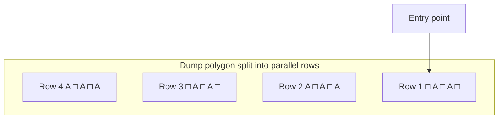
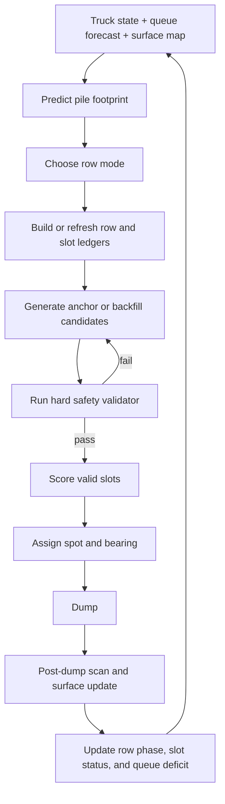

# Dynamic Staggered Row Filling with Reserved Backfill Slots for Autonomous Dump Operations

## Executive Summary

This report specifies a production-oriented filling method for autonomous dump placement: **Dynamic Staggered Row Filling with Reserved Backfill Slots**. The method is designed as an enhancement to the project’s existing centralized ADPS kernel rather than a replacement for the broader strategy framework. The project files already define the core ADPS loop as: maintain an authoritative surface map, predict pile footprint from payload and material, generate candidate spots, validate slope/footprint/reverse-sweep/conflict constraints, assign the spot, and refresh the map after dumping. The current simulation prototype adds staggered packing, furthest-point-first retreat, overlap control through `gapDistance`, and row partitioning. The proposed method generalizes those ideas into a **two-pass, class-aware row planner** that supports high-density packing without sacrificing maneuverability or mixed-fleet robustness. fileciteturn0file1 fileciteturn0file3 fileciteturn0file4

The key design move is to stop treating the gap between early dumps as “wasted space.” In this report, the gap is a **reserved future slot** sized from the predicted footprint of the truck class expected to backfill it. The row is built in two phases. In the **anchor phase**, the planner places alternating anchor dumps to create a stable ridge skeleton and preserve temporary access room. In the **backfill phase**, it uses the refreshed surface map to place the best-fitting subsequent truck into the measured saddle, with controlled edge overlap to maximize density. This is more defensible than pure sequential overlap when fleet composition, payload, material behavior, pose uncertainty, or local geometry are changing from dump to dump. fileciteturn0file1 fileciteturn0file3 fileciteturn0file4

Mixed-fleet management is the main reason this approach matters. In real operation, pile spread depends on payload, material, and discharge behavior, so a fixed inter-dump spacing is not technically sound. The proposed planner therefore sizes every reserved slot from **predicted effective radius**, **allowed overlap**, and **uncertainty margin**, then tags the slot with a reservation class so large trucks create the row skeleton while smaller trucks clean up irregular residuals. That fits the project’s own emphasis on mixed-fleet adaptive strategies and aligns with current mining autonomy practice, where centralized fleet control and truck assignment remain core system features. The current mining autonomy safety baseline is still ISO 17757:2019, confirmed in 2024, and official OEM autonomy systems continue to emphasize real-time centralized or fleet-managed truck assignment and controlled operating envelopes. fileciteturn0file1 citeturn10view1turn10view0turn11view4turn12view2

The most important implementation conclusions are straightforward. First, use this method as the **primary adaptive fill kernel** inside S3/S4-style operation, not as a separate disconnected algorithm family. Second, keep **pure sequential overlap** as a high-density fast path only when fleet variability is low and map confidence is high. Third, use **MILP/CP-SAT** and other exact optimization tools primarily as offline benchmarks or short-horizon supervisors, not as the first production runtime planner. Fourth, delay RL-driven packing policy work until deterministic geometry, uncertainty modeling, and slot-reservation behavior are stable. fileciteturn0file1 citeturn11view3turn14view2turn14view0turn5search1

## Problem Statement and Design Basis

The underlying operational problem is that static or weakly adaptive dump-point assignment wastes usable dump area because actual piles do not land as perfect copies of one another. Payload fluctuates, materials spread differently, discharge headings vary, and local ground shape perturbs the realized mound. The project’s own mathematical note therefore models the yard as a height map and the pile as an elliptical or Gaussian mound, while the URS requires live surface-map refresh and candidate regeneration after each dump. The simulation note separately shows why the prototype already moved away from random placement, using staggered rows, retreat-from-farthest-edge logic, and overlap-aware occupancy management. fileciteturn0file1 fileciteturn0file3 fileciteturn0file4

The proposed approach should be understood as a **main filling approach**, while scenario logic remains an overlay. That is consistent with the URS, which defines ADPS as a centralized planning system with strategy-family switching through the DSDE rather than a single universal dump-placement rule. In practice, this means the staggered row planner lives inside the adaptive family and is conditioned by S6 and S7 style safety and degraded-mode logic rather than replacing them. Mixed-fleet operation, irregular polygons, high fill, and rapidly changing edge states already push the URS toward adaptive modes, which is exactly where a row-based reserved-slot planner is most useful. fileciteturn0file1

Several items remain unspecified or inconsistent across the uploaded files, so the report makes explicit engineering assumptions rather than hiding them.

| Unspecified or inconsistent item | Report assumption | Why the assumption is needed |
|---|---|---|
| Exact truck model list and body geometries | Slot classes are based on **predicted effective radius** and discharge orientation, not vendor model names | The user asked for mixed-fleet handling, but the project files do not freeze the operational fleet |
| Pile spread coefficient convention | Use a **composite spread coefficient** in runtime math; treat coefficient decomposition as a configuration detail | The mathematical note and prototype note use different numeric conventions for spread constants |
| Queue forecast horizon | Use the next **5 arrivals or 10 minutes**, whichever is shorter | Long enough to reserve meaningful slots; short enough to avoid overfitting stale forecasts |
| Allowed shoulder overlap | Start with a **conservative controlled-overlap ratio** and tune upward only after slope validation | Density improves with overlap, but excessive overlap spikes local gradient |
| Uncertainty aggregation | Use a conservative additive envelope at first; move to RSS-based probabilistic margins only after sensor/model calibration | The project defines sensor roles and map refresh but not full covariance treatment |
| Anchor-to-backfill switch point | Trigger backfill when row-end slack is small or row utilization is high | The project defines adaptive scoring but not a specific row-phase threshold |
| Occupancy-grid resolution for slot masks | Use surface-map resolution or one refinement level finer | Needed to prevent false stack-on-stack acceptance |

These assumptions follow directly from open issues in the URS, from the prototype note’s separate conventions, and from the mathematical supplement’s coefficient derivations. They should be treated as explicit configuration items, not buried defaults. fileciteturn0file1 fileciteturn0file3 fileciteturn0file4

## Inputs, Assumptions, and Data Models

The method requires the same operational inputs already present in the URS and sensor note, plus a forecast view of the short truck queue. The most important fields are listed below.

| Input | Example fields | Primary use in the planner |
|---|---|---|
| Truck state | `truck_id`, position, heading, speed, approach state | Determines feasible row access, row order, and reverse-sweep logic |
| Load state | payload tonnes, material type, dump heading | Drives pile footprint prediction and class assignment |
| Surface state | height map, slope map, occupied mask, map age | Supports candidate generation, gap sizing, and validation |
| Geometry | active polygon, inset polygon, entry point, row bearing | Defines row zoning and usable placement envelope |
| Health state | GPS accuracy, LiDAR status, V2V status, visibility, rain | Drives S6/S7-like conservatism and degraded-mode fallback |
| Queue forecast | predicted ETAs, payload estimates, material, confidence | Chooses reservation class and starvation prevention priority |
| Uncertainty state | pose error, map error, pile-model error, control error | Expands the margin used in slot sizing and validation |

The project files already define most of these categories explicitly: the URS lists payload, material, map state, communications health, environmental triggers, and polygon geometry, while the sensor note defines the nominal sensing stack behind pose, obstacle detection, edge determination, and dump-state confirmation. GPS, LiDAR, radar, IMU, wheel encoders, load sensors, tilt, and rear-edge sensing are all already part of the sensing model. fileciteturn0file1 fileciteturn0file5

The height-map and pile-footprint model should remain the mathematical foundation. The project note already uses an elliptical or Gaussian pile description and the cube-root law for spread. For runtime engineering, the cleanest formulation is:

\[
V_t = \frac{p_t}{\rho_m}
\]

\[
r_{x,t} = \kappa_m \, V_t^{1/3}
\]

\[
r_{y,t} = AR_t \, r_{x,t}
\]

\[
H_t(x,y) = H_{\text{peak},t}\exp\left(-\left(\frac{(x-c_x)^2}{r_{x,t}^2}+\frac{(y-c_y)^2}{r_{y,t}^2}\right)\right)
\]

\[
H_{\text{peak},t} = \frac{V_t}{\pi r_{x,t} r_{y,t} C_{\text{shape}}}
\]

where \(p_t\) is payload, \(\rho_m\) is bulk density, \(\kappa_m\) is a calibrated spread coefficient for the active material, \(AR_t\) is the discharge-shape aspect ratio, and \(C_{\text{shape}}\) is the mound-shape calibration constant. This general form preserves the current project math while normalizing away the coefficient-convention mismatch between the prototype note and the mathematical supplement. fileciteturn0file1 fileciteturn0file3 fileciteturn0file4

For row planning, the planner needs a **directional effective radius** rather than a raw ellipse radius. If \(\phi_t\) is the dump major-axis bearing and \(\psi\) is the row bearing, then with \(\Delta=\psi-\phi_t\),

\[
r_{\text{eff},t}(\psi)=\left(\frac{\cos^2\Delta}{r_{x,t}^2}+\frac{\sin^2\Delta}{r_{y,t}^2}\right)^{-1/2}
\]

This converts an anisotropic pile into a one-dimensional spacing quantity along the row. A corresponding transverse effective radius \(r^\perp_{\text{eff},t}\) is computed by using the row-normal bearing. This is the correct object for gap sizing; truck model names are not. fileciteturn0file4

The surface admissibility model should also remain aligned with the URS. The local gradient prefilter is

\[
g(x,y)=\sqrt{\left(\frac{\partial H}{\partial x}\right)^2+\left(\frac{\partial H}{\partial y}\right)^2}
\]

with finite differences

\[
\frac{\partial H}{\partial x}\approx\frac{H(x+1,y)-H(x-1,y)}{2\Delta_c}, \qquad
\frac{\partial H}{\partial y}\approx\frac{H(x,y+1)-H(x,y-1)}{2\Delta_c}
\]

where \(\Delta_c\) is map cell size. The URS uses \(g \le 0.6\) as the inferred centralized prefilter, then requires a separate predicted post-dump slope check in degrees, plus footprint containment, reverse-sweep clearance, overlap, and conflict checks. That distinction should be preserved in code rather than collapsed into one threshold. fileciteturn0file1

## Row Zoning, Slot Reservation, and Gap Sizing

The dump polygon should be divided into **parallel working rows** referenced from the entry point. The planner first computes a travel axis from the entry point toward the farthest feasible interior region, then forms row centerlines parallel to the preferred truck travel direction and offsets them by a transverse row pitch. Filling starts on the farthest valid row and retreats toward the entry so approaching trucks do not drive past newly formed ridges any earlier than necessary. That retreat logic is directly consistent with the prototype’s furthest-point-first and retreating fill patterns, but the proposed method organizes the resulting area into row ledgers and slot ledgers instead of free-running columns. fileciteturn0file3 fileciteturn0file1



In the diagram, `A` means **anchor dump placed now** and `□` means **reserved slot to be backfilled later**. The planner starts at the farthest row and retreats toward the entry; the stagger between adjacent rows creates a honeycomb-like interlock similar to the current prototype, but with explicit reservation semantics instead of implicit spacing alone. fileciteturn0file3

The planner operates in two row phases. In the **anchor phase**, it places alternating anchor dumps, each one creating a class-tagged reservation between neighboring anchors. In the **backfill phase**, it fills those reservations once the row is sufficiently constrained that holding them open no longer buys useful access. Crucially, backfill is not centered in the empty visual gap. It is placed into the **measured saddle** between two realized shoulders so density is recovered through controlled overlap rather than by preserving a permanent void. That is the right answer to the density criticism of naive gapped packing. The gap is temporary, and overlap is delayed until it can be measured against an updated map. fileciteturn0file3 fileciteturn0file4

The gap between candidate centers is therefore not fixed. Let \(i\) be an existing anchor, \(j\) the reserved future slot, and \(k\) the next anchor. Let \(r_i, r_j, r_k\) denote effective radii along the row. Then the basic center spacing is

\[
d_{ij}=r_i+r_j+g_{ij}-o_{ij}+m_{ij}
\]

where \(g_{ij}\) is the free-gap target, \(o_{ij}\) is the allowed controlled shoulder overlap, and \(m_{ij}\) is the uncertainty margin. The required anchor pitch for a single reserved slot between two anchors is

\[
P(i,j,k)=d_{ij}+d_{jk}
\]

If the row is locally symmetric, this simplifies to

\[
P \approx r_i + 2r_j + r_k + 2g_{\text{free}} - 2o_{\text{allow}} + 2m_{\text{unc}}
\]

This equation is the core sizing rule. It shows why “leave one dump of space” is insufficient: the pitch depends on both the current anchor and the **future reserved class**. fileciteturn0file1 fileciteturn0file4

The overlap allowance should itself be explicit:

\[
o_{ij}=\min\left(\beta_{\text{ov}}(r_i+r_j),\; o_{\max},\; o_{\text{slope-safe}}\right)
\]

where \(\beta_{\text{ov}}\) is a configured overlap ratio, \(o_{\max}\) is an absolute cap, and \(o_{\text{slope-safe}}\) is the largest overlap that still preserves post-dump slope and height limits. In other words, overlap is a **controlled design parameter**, not a bonus side effect. fileciteturn0file3 fileciteturn0file1

The uncertainty margin is equally important. A conservative safety-biased implementation can use a simple additive form:

\[
m_{ij}=m_{\text{pose}}+m_{\text{map}}+m_{\text{model}}+m_{\text{material}}+m_{\text{control}}
\]

Once field calibration exists and the components are treated as approximately independent, a probabilistic alternative is:

\[
m_{ij}=k_{\sigma}\sqrt{\sigma_{\text{pose}}^2+\sigma_{\text{map}}^2+\sigma_{\text{model}}^2+\sigma_{\text{material}}^2+\sigma_{\text{control}}^2}
\]

The additive version should be preferred until the sensor and pile-model error distributions are measured well enough to justify RSS-style aggregation. The sensor note supports this conservatism because the dump decision depends on multiple fused sensors with different latencies and failure modes, not a single perfect measurement channel. fileciteturn0file5 fileciteturn0file1 citeturn10view1

For mixed-fleet management, reservation classes should be defined from **footprint ranges**, not nominal truck models. A usable default is a four-band class system:

| Reservation class | Feasible radius band | Primary role in this report |
|---|---|---|
| Small | cleanup band | boundary cleanup, row-end fill, irregular pockets |
| Medium | regular band | mainstream backfill and secondary anchors |
| Large | large-footprint band | main anchor formation in open rows |
| XL | top-footprint band | early skeleton creation in the widest rows |

If exact model families are known later, static model-class mapping can be added. Until then, the cleaner engineering pattern is to define classes from rolling fleet quantiles or from configured radius bands computed from payload and material. That makes the planner agnostic to the actual OEM mix. This is also consistent with the official autonomy trend toward centralized fleet-level optimization rather than per-truck local heuristics. fileciteturn0file1 citeturn10view0turn11view4turn12view1

The reservation class for the next skipped slot should be selected from the near queue forecast. Let \(\hat A_c(H)\) be the expected arrivals of class \(c\) within horizon \(H\), and \(N^{open}_c\) the number of open reservations already available for that class. Then

\[
\text{deficit}_c = \hat A_c(H)-N^{open}_c
\]

\[
c^\*=\arg\max_c \left(\alpha\,\text{deficit}_c+\gamma\,\text{criticality}_c\right)
\]

where `criticality` can up-weight Large and XL classes when the row is still open and down-weight them near row end. This formalizes the intuition that large trucks should rarely be forced into late awkward pockets when they could have defined the ridge skeleton earlier. That is the same structural logic used in broader mine-fleet allocation research, where allocation and dispatch are treated as primary, coupled decisions rather than as separate afterthoughts. citeturn17view0turn16view0

A mixed-fleet example makes the effect visible. The mathematical note provides a self-consistent coal example set with approximately \(r_L=7.62\) m for a 400 t large truck, \(r_M=6.43\) m for a 250 t medium truck, and \(r_S=5.46\) m for a 150 t small truck under one calibrated convention. Using those radii with a free-gap benchmark of 3.03 m, a controlled overlap allowance of 2.0 m, and a nominal uncertainty margin of 0.8 m yields the following anchor pitches. The calculations below are derived from the equations above and use the mathematical supplement’s worked-example scaling, which is internally consistent even though the prototype note expresses material coefficients in a different convention. fileciteturn0file4 fileciteturn0file3

| Case | Left anchor | Reserved slot | Right anchor | \(g_{\text{free}}\) | \(o_{\text{allow}}\) | \(m_{\text{unc}}\) | Required anchor pitch |
|---|---:|---:|---:|---:|---:|---:|---:|
| Large skeleton with small backfill | 7.62 m | 5.46 m | 7.62 m | 3.03 m | 2.0 m | 0.8 m | 29.82 m |
| Large skeleton with medium backfill | 7.62 m | 6.43 m | 7.62 m | 3.03 m | 2.0 m | 0.8 m | 31.76 m |
| Large skeleton with large backfill | 7.62 m | 7.62 m | 7.62 m | 3.03 m | 2.0 m | 0.8 m | 34.14 m |
| Same as medium backfill under worse map/pose uncertainty | 7.62 m | 6.43 m | 7.62 m | 3.03 m | 2.0 m | 1.5 m | 33.16 m |

Two operational consequences follow immediately. First, reserving for a medium backfill instead of a small one increases pitch and lowers early apparent density, but preserves future feasibility for the more constrained truck. Second, degraded certainty mechanically pushes pitch upward, which is exactly what a safety-first planner should do. The gap is therefore not an arbitrary spacing; it is a **forecasted, class-tagged, uncertainty-aware future placement envelope**. 

## Dispatch, Safety, and Hybrid Switching

The mixed-fleet dispatch policy should be queue-aware and class-aware. The rule set is simple but powerful: **Large and XL trucks build the skeleton, medium trucks maintain flow, and small trucks repair residual geometry**. A small truck should not consume a premium interior anchor slot if a large truck is already in the near queue forecast, because doing so converts a future high-value slot into a low-value cleanup slot. Conversely, when only small trucks remain and the row is nearly closed, they should be directed toward aged reserved slots, boundaries, and row-end pockets. The planner should be willing to hold or redirect a badly matched truck rather than forcing a class mismatch that creates unfillable voids later. fileciteturn0file1 citeturn17view0turn10view0turn11view4

A weighted slot score is the best way to operationalize that behavior. A recommended normalized form is

\[
\text{Score}(t,s)=
w_{\text{fit}}F_{\text{fit}}+
w_{\text{row}}F_{\text{row}}+
w_{\text{density}}F_{\text{density}}+
w_{\text{queue}}F_{\text{queue}}+
w_{\text{dist}}F_{\text{dist}}+
w_{\text{age}}F_{\text{age}}
-
w_{\text{slope}}R_{\text{slope}}-
w_{\text{conflict}}R_{\text{conflict}}-
w_{\text{boundary}}R_{\text{boundary}}-
w_{\text{unc}}R_{\text{unc}}
\]

where \(F_{\text{fit}}\) measures compatibility with the slot’s target radius band, \(F_{\text{row}}\) rewards row completion or backfill closure, \(F_{\text{density}}\) rewards compactness gain and dead-space recovery, \(F_{\text{queue}}\) rewards reduction of class deficit, \(F_{\text{dist}}\) penalizes travel or reverse effort, and \(F_{\text{age}}\) prevents long-lived orphaned slots. The risk terms penalize local slope margin loss, reverse-sweep conflict, boundary pressure, and uncertainty exposure. This form is deliberately compatible with both heuristic and optimization-based planners. The URS already expects adaptive strategy scoring, while mining and multi-robot allocation literature both support explicit cost or bid evaluation under heterogeneous constraints. fileciteturn0file1 citeturn13view0turn13view2turn17view1turn11view3

Safety gates should remain hard filters rather than soft penalties wherever the URS already treats them as invariants. The table below consolidates the operational validator.

The safety validator below synthesizes the URS common validator, the sensor note, and the autonomy safety scope of ISO 17757. fileciteturn0file1 fileciteturn0file5 citeturn10view1

| Gate | Rule | Action on failure |
|---|---|---|
| Map freshness | Do not assign a close-proximity slot if the local map is stale after a recent dump | Hold nearby assignments until refresh |
| Local gradient prefilter | Reject if \(g(x,y) > g_{\max}\) | Shift candidate or mode-switch |
| Predicted post-dump slope | Reject if projected slope exceeds scenario threshold | Reject slot |
| Footprint containment | Entire predicted footprint must remain inside inset polygon | Reject slot |
| No-isolation rule | Reject slot if it would create an isolated unfillable pocket | Reject slot |
| Overlap admissibility | Reject if controlled overlap exceeds slot or slope-safe allowance | Reject slot |
| Reverse-sweep | Reject if reverse or exit sweep exits polygon or intersects an active sweep | Hold lower-priority truck |
| Multi-truck conflict | No simultaneous assignment to the same or conflicting slot region | Hold or re-score |
| Health override | Sensor or comm degradation beyond thresholds triggers conservative fallback | Enter degraded mode |
| Degraded-mode invariant | Only prevalidated conservative spots; one truck in active zone | Enforce hard limit |

The queue-aware planner should also switch between **sequential-overlap mode** and **anchor-backfill mode**. Sequential-overlap mode is appropriate when the fleet is effectively homogeneous, the polygon is regular, sensor confidence is high, and first-pass candidate rejection is low. Anchor-backfill mode should become the default when fleet heterogeneity rises, the polygon is irregular, the row is near closure, uncertainty rises, or contention between trucks increases. The URS already captures part of this at the strategy-family level by preferring adaptive handling for mixed fleets and harder constraints in irregular geometries. The recommended row-level switch extends that same logic inward. fileciteturn0file1

A practical row-mode policy is:

| Condition | Preferred mode | Reason |
|---|---|---|
| Dominant class share in queue is very high and row is wide open | Sequential-overlap | Maximize density and speed |
| Mixed queue, irregular boundary, or growing rejection rate | Anchor-backfill | Preserve recoverability and fit quality |
| Late row stage or boundary cleanup | Anchor-backfill | Prevent trapped residual pockets |
| S6-like reduced confidence, rain, soft ground, or low visibility | Anchor-backfill with widened margins | Safety before compactness |
| S7-like degraded health | Neither; use conservative preloaded spots | Runtime adaptive geometry should stop |

The runtime loop remains simple.



## Alternative Algorithms and Comparative Use Cases

Dynamic Staggered Row Filling with Reserved Backfill Slots should be the recommended **mainline adaptive packing algorithm**, but it should not be the only algorithm in the toolbox. The comparison below combines the project strategy families with well-established packing, assignment, and scheduling families from the literature. Cutting-and-packing work is useful here because dump placement is still, at bottom, an online irregular packing problem with additional safety, kinematic, and geotechnical constraints. fileciteturn0file1 fileciteturn0file3 citeturn18view0turn14view2turn14view0turn17view0turn17view1turn13view0turn11view3turn15search1turn4search3turn5search1

| Approach | Core mechanism | Strengths | Main limitation | Best use |
|---|---|---|---|---|
| Regular precomputed grid | Fixed slot lattice across polygon | Simple, fast, explainable | Fragile when actual pile spread drifts | Early homogeneous fill on regular polygons |
| Polygon-aware staggered grid | Precomputed staggered slots within inset polygon | Better boundary use than plain grid | Still weak under dynamic pile drift | Irregular but predictable shapes |
| Frontier normal-offset adaptive | Place next dump off measured frontier normal | Very responsive to realized surface | Can become locally greedy without row structure | High-fill adaptive operation |
| Greedy sequential-overlap row | Always place next dump beside previous shoulder | Very dense when conditions are stable | Error propagation, mixed-fleet brittleness | Homogeneous fleet, low uncertainty, open rows |
| Prototype columnar honeycomb | Parallel columns, half-step staggering, overlap factor | Good simulation baseline; naturally partitions traffic | Column-first logic is not enough for mixed-fleet slot planning | Rapid prototyping and UI demos |
| **Dynamic staggered row filling with reserved backfill slots** | Alternate anchors, class-tagged reservations, saddle backfill | Highest practical balance of density, robustness, and mixed-fleet control | More state and tuning than simple greedy rules | Recommended production adaptive fill kernel |
| P2P sequential choke protocol | Mutual exclusion around narrow dump access | Safest for choke points | Intentionally sacrifices throughput and packing freedom | Valley/choke-point fill |
| Windrow or reclaim-lane stockpile mode | Preserve reclaim lanes and layer order | Good for reclaimability and grade control | Not the densest packing mode | ROM stockpiles and blending yards |
| MILP or CP-SAT short-horizon optimizer | Solve constrained assignment or mini-planning windows optimally | Excellent benchmark and policy-check tool | Too heavy for full online geometry at large scale | Offline benchmarking; limited horizon supervision |
| Auction-based dispatcher | Trucks or tasks bid against costed options | Adapts well to heterogeneous teams and reallocation | Needs robust bid-cost design and still needs geometry kernel | Overlay for multi-truck slot assignment |
| RL or learned packing policy | Learn placement policy from simulation | Can discover non-obvious policies | Data hunger, explainability issues, unstable safety envelopes | Later-stage research after deterministic baseline |

Three observations matter most. First, the project’s existing S1/S2/S5/S7 family remains valid; the new row planner should sit alongside them, mainly as the adaptive packing kernel for S3/S4-like operation. Second, for irregular boundaries, ideas from bottom-left-fill and no-fit-polygon work are still relevant, especially for last-slot fitting, corner cleanup, and precise boundary feasibility. Third, optimization and learning methods are best treated as **benchmarks and overlays** until the deterministic row/slot validator is mature. Peer-reviewed packing work shows why robust geometry handling matters; mine scheduling papers show why exact mathematical scheduling and heuristic overlays are often combined; official optimization tooling shows that assignment, routing, packing, and scheduling live naturally in one solver ecosystem. citeturn14view2turn14view0turn17view1turn11view3

Windrow deserves a special note because it is often misunderstood. In the project corpus, windrow is not the main fill algorithm. It is a **stockpile modifier** for ROM-style reclaimability and grade layering. Independent stockpile literature supports that distinction: windrow and chevron patterns are principally about blending and reclaim behavior, and some studies explicitly note that windrow stacked with bench reclaiming can be undesirable for homogenization under certain regimes. That makes windrow a scenario-specific operational mode, not the default answer to autonomous dump densification. fileciteturn0file1 citeturn15search1turn4search3turn15search6turn1search5

## Parameters, Validation, Implementation, and Source Priority

### Recommended default parameters and ranges

The table below combines explicit project parameters with proposed tuning values required by the new row-reservation method. Values marked **explicit** or **inferred** come from the project corpus; values marked **proposed** are actionable starting points for engineering simulation and calibration. fileciteturn0file1 fileciteturn0file3 fileciteturn0file4

| Parameter | Default | Range | Status | Engineering meaning |
|---|---:|---:|---|---|
| Surface map cell size | 0.25 m | 0.25–0.50 m | Explicit | Height-map and occupancy-grid resolution |
| Candidate shift step | 0.10 m | 0.05–0.25 m | Explicit | Retry displacement when slot fails validation |
| Max shift retries | 20 | 10–40 | Explicit | Retry budget before hold or escalation |
| Polygon inset | 2.0 m | 1.0–4.0 m | Explicit | Guards against footprint/boundary breach |
| Target free-gap benchmark | 3.03 m | 2.0–4.0 m | Explicit | Free-gap target before controlled overlap |
| Mean spacing target | ≤ 3.5 m | scenario-based | Explicit | Project packing target under normal ops |
| Slope prefilter \(g_{\max}\) | 0.6 | 0.5–0.7 | Inferred | Early local-gradient reject threshold |
| Post-dump slope limit | 28° | 24°–32° | Explicit by scenario | Hard geotechnical admissibility gate |
| S6 terrain trigger | 25° | 22°–28° | Explicit | Activates safety overlay |
| Degraded-mode min spacing | 5.0 m | 5.0–7.0 m | Explicit | Conservative fallback slot spacing |
| Prototype ridge cap | 10.0 m | scenario-based | Prototype | High-level pile-height cap |
| Queue lookahead horizon | 5 arrivals or 10 min | 3–8 arrivals / 5–15 min | Proposed | Reservation-class planning horizon |
| Dominant-class share for sequential mode | 0.80 | 0.70–0.90 | Proposed | Homogeneity threshold for greedy overlap |
| Fleet heterogeneity CV threshold | 0.15 | 0.10–0.25 | Proposed | Switch trigger to anchor-backfill |
| Controlled shoulder-overlap ratio \(\beta_{\text{ov}}\) | 0.15 | 0.10–0.30 | Proposed | Density gain with bounded slope risk |
| Row backfill trigger | 70% utilized or ≤1 open anchor pitch left | 60%–80% | Proposed | Switch from anchor phase to backfill phase |
| Uncertainty safety factor \(k_\sigma\) | 1.5 | 1.0–2.5 | Proposed | Converts variance to operational margin |
| Slot-age priority gain | 0.05 per tick | 0.01–0.10 | Proposed | Prevents reserved-slot starvation |
| State publish interval | 500 ms | hardware-specific | Explicit | Truck-to-server cadence |
| Decision latency budget | 2 s | 1–3 s | Explicit | Maximum time for planning cycle |

Defaults marked explicit are already grounded in the project URS. Proposed values should be tuned by simulation first, then tightened or relaxed after pile-shape and sensor-error calibration in the field. fileciteturn0file1

### Simulation and validation plan

Validation should be staged rather than attempted all at once. Start with **geometry unit tests** to verify pile updates, directional effective radii, no-isolation logic, overlap checks, and reverse-sweep masks. Then run **single-row deterministic simulations** to compare sequential-overlap against anchor-backfill under identical payload sequences. After that, introduce **mixed-fleet Monte Carlo** runs with queue perturbations, polygon irregularity, material changes, and sensor noise. Only after those pass should the planner move into **multi-truck concurrency**, S6-like environmental perturbation, and S7 degraded-mode verification. This sequence matches the project’s explicit central-validator architecture and is also consistent with how industrial scheduling and optimization methods are usually benchmarked before being promoted into real-time loops. fileciteturn0file1 citeturn16view0turn17view1turn11view3

The comparison set should include at least: regular grid, polygon-aware staggered grid, frontier-only adaptive, greedy sequential-overlap, current prototype columnar-honeycomb, and the proposed row-reservation planner. For smaller horizons or offline validation, an exact or near-exact assignment benchmark should also be used so the heuristic runtime planner can be measured against something stronger than itself. That is where CP-SAT or MILP become useful. citeturn11view3turn17view1

The core metrics should be computed consistently across all scenarios.

| Metric | Definition | Why it matters |
|---|---|---|
| Areal density | Occupied usable area / usable polygon area | Direct measure of spatial packing effectiveness |
| Compaction or ridge continuity index | Fraction of filled area with no unfillable gaps larger than smallest class footprint | Measures whether the planner creates unusable residual voids |
| Throughput | Dumps per hour and tonnes per hour | Required for operational viability |
| Conflict rate | Sweep holds or assignment conflicts per 100 dumps | Measures multi-truck safety quality |
| Wasted area | Area of isolated pockets smaller than smallest feasible footprint | Direct measure of bad slot decisions |
| Candidate rejection rate | Rejected candidates / generated candidates | Measures whether the slot sizing logic is realistic |
| Slot aging | Mean time a reservation remains open | Detects starvation of backfill slots |
| Class mismatch rate | Assignments where truck class is outside slot target band | Measures mixed-fleet discipline |
| Mode-switch correctness | Fraction of cases where sequential mode or anchor-backfill wins according to outcome | Validates hybrid policy |
| Degraded-mode stability | Zero unsafe conflicts under health faults | Confirms conservative fallback behavior |

The implementation report should also include charts, because charts make tuning faster than prose alone. At a minimum, include: pack density versus fill percentage, throughput versus active truck count, conflict rate versus fill percentage, wasted area versus fleet heterogeneity, candidate-rejection Pareto by failure cause, and overlap ratio versus peak slope. The project already emphasizes spacing, throughput, drift, and conflict tracking; the proposed charts simply formalize those metrics into an engineering dashboard. fileciteturn0file1

### Implementation notes

The implementation stack should stay close to the URS: Python backend, FastAPI service layer, Pydantic schemas, Shapely geometry, NumPy surface map, MQTT for server-to-truck coordination, and direct peer-to-peer WebSocket only where choke logic truly requires it. That is already explicit in the corpus and is aligned with a centralized fleet-planning architecture. Official mining autonomy systems also continue to emphasize centralized or supervisory fleet control, real-time visibility, and assignment optimization rather than purely decentralized dump placement. fileciteturn0file1 citeturn10view0turn11view4turn12view1

A minimal slot ledger should carry enough state to support class-aware reservation, reallocation, and auditability.

| Field | Type | Meaning |
|---|---|---|
| `slot_id` | UUID | Unique slot identifier |
| `row_id` | int | Owning row |
| `chainage_m` | float | Along-row coordinate |
| `offset_m` | float | Row-normal coordinate |
| `phase` | enum | `anchor`, `reserved`, `ready_backfill`, `filled`, `invalid` |
| `reserved_class` | enum | `S`, `M`, `L`, `XL` |
| `r_target_m` | float | Target effective radius |
| `r_min_m` / `r_max_m` | float | Feasible fit band |
| `g_free_m` | float | Free-gap benchmark used for sizing |
| `overlap_allow_m` | float | Maximum allowed controlled overlap |
| `uncertainty_margin_m` | float | Current safety margin |
| `left_neighbor` / `right_neighbor` | UUID | Adjacent slots or anchors |
| `status` | enum | `open`, `assigned`, `held`, `filled` |
| `assigned_truck_id` | string/null | Current assignee |
| `risk_flags` | bitfield/json | Boundary, slope, uncertainty, conflict warnings |
| `map_age_s` | float | Local freshness of surface data |
| `slot_age_s` | float | Time since reservation opened |
| `last_eval_ts` | timestamp | Last score update |

A row ledger should track row bearing, transverse pitch, stagger offset, row phase, fill fraction, remaining anchor capacity, and conflict state. Using explicit ledgers is what turns a nice visual pattern into an implementable control system.

The core planner can be expressed cleanly in API-like pseudocode:

```python
class TruckState(BaseModel):
    truck_id: str
    position_xy: tuple[float, float]
    heading_deg: float
    speed_ms: float
    payload_tonnes: float
    material: str
    dump_bearing_deg: float
    health: dict
    eta_to_zone_s: float

class QueueForecast(BaseModel):
    arrivals: list[TruckState]
    horizon_s: float
    confidence: float

class SpotAssignment(BaseModel):
    truck_id: str
    slot_id: str
    target_xy: tuple[float, float]
    bearing_deg: float
    mode: str
    s6_active: bool
    degraded: bool

def predict_footprint(truck, material_model) -> Footprint:
    # volume, rx, ry, peak, directional effective radii
    ...

def choose_fill_mode(zone_state, queue_state, uncertainty_state) -> str:
    # returns "sequential_overlap", "anchor_backfill", or "degraded"
    ...

def size_reserved_slot(left_anchor, reserve_class, right_anchor, uncertainty) -> SlotSpec:
    # applies d_ij = r_i + r_j + g - o + m
    ...

def generate_candidates(truck, rows, slots, mode) -> list[Candidate]:
    # anchor candidates, reserved backfill candidates, row starters, cleanup slots
    ...

def validate_candidate(candidate, truck, map_state, polygon_state, active_assignments) -> bool:
    # slope, footprint, overlap, reverse-sweep, boundary, no-isolation, health
    ...

def score_candidate(truck, candidate, queue_state, zone_state) -> float:
    # weighted score with fit, density, row completion, queue relief, distance, risk
    ...

def assign_next_spot(truck, state) -> SpotAssignment | HoldDecision:
    fp = predict_footprint(truck, state.material_model)
    mode = choose_fill_mode(state.zone, state.queue, state.uncertainty)
    candidates = generate_candidates(truck, state.rows, state.slots, mode)
    feasible = [c for c in candidates if validate_candidate(c, truck, state.map, state.polygon, state.active)]
    if not feasible:
        return hold_or_open_next_row(truck, state)
    best = max(feasible, key=lambda c: score_candidate(truck, c, state.queue, state.zone))
    return commit_assignment(truck, best, mode)

def post_dump_update(surface_update, state):
    # refresh local map, update row/slot ledgers, recalc deficits, rescore nearby reservations
    ...
```

This is the smallest implementation skeleton that still preserves the engineering logic described in the report.

### Priority source stack

The source hierarchy for implementation and publication should be explicit.

1. **Project files first.** The URS is the primary authority for ADPS architecture, validator logic, DSDE behavior, messaging, safety overlays, degraded mode, and scenario structure. The prototype simulation note is the primary authority for current staggered packing, furthest-point-first retreat, overlap control, and partitioning behavior. The mathematical supplement is the primary authority for pile-shape math and worked examples. The sensor note is the primary authority for sensor roles and indicative frequencies. fileciteturn0file1 fileciteturn0file3 fileciteturn0file4 fileciteturn0file5

2. **Standards and official autonomy system sources second.** Use entity["organization","International Organization for Standardization","standards body"] for the current autonomy safety baseline, then official OEM sources from entity["company","Komatsu","mining equipment maker"] and entity["company","Caterpillar","mining equipment maker"] to ground real-world AHS assumptions about centralized fleet control, mixed-fleet support, and dispatch-managed operations. These sources do not define the project algorithm, but they are appropriate for real-world context and external defensibility. citeturn10view1turn10view0turn11view4turn12view2

3. **Primary packing and computational-geometry literature third.** Wäscher et al. are the right typology source for classifying this as a dynamic cutting-and-packing problem; Burke et al. on bottom-left-fill are the right reference for aggressive greedy packing heuristics; Burke et al. on no-fit polygons are the right geometry reference for irregular-boundary feasibility and last-slot fitting. citeturn18view0turn14view2turn14view0

4. **Mine dispatch and allocation literature fourth.** Use open-pit fleet allocation and truck-scheduling papers for queue-aware dispatch, objective design, and benchmark optimization comparisons. The strong theme across that literature is that allocation and dispatch remain central, dynamic mine-control decisions, which supports the reserved-slot/queue-deficit logic proposed here. citeturn17view0turn17view1turn16view0

5. **Stockpile and blending literature fifth.** Use stockpile and blending studies only where reclaimability, windrow/chevron behavior, grade-layering, or geometry-constrained stockpiling need to be justified. They are important for ROM and stockyard variants, but they should not drive the main autonomous dump densification logic outside those scenarios. citeturn15search1turn4search3turn15search6turn1search5

The engineering recommendation is therefore clear. Implement **Dynamic Staggered Row Filling with Reserved Backfill Slots** as the primary adaptive packing kernel inside the project’s centralized planner. Keep sequential-overlap as an opportunistic fast path, keep S5/S6/S7 and ROM logic as overlays, benchmark the runtime planner against exact or near-exact short-horizon solvers, and postpone learned policies until the deterministic row/slot system has been validated under mixed-fleet uncertainty. That is the most technically defensible path from the current project files to an implementable autonomous dump-placement engine.